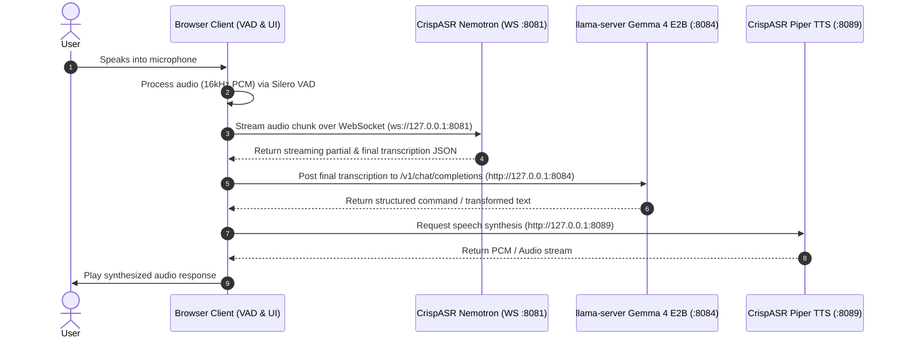

# Voice Commands & Real-Time Streaming ASR Demo

A complete end-to-end, locally hosted voice interface demo combining browser-based audio capture, client-side Voice Activity Detection (VAD), low-latency streaming Speech-to-Text (ASR), Large Language Model (LLM) text transformation, and Text-to-Speech (TTS) voice feedback—running fully offline on a Windows CPU.

---

## 🔗 Quick Links

* [← Back to Root README](../README.md)
* [Commands Scratchpad Reference](../commands.md)

---

## 🚀 Overview & Features

This demo demonstrates a full voice interaction pipeline operating locally:

1. **Browser Microphone Capture**: Captures 16 kHz 16-bit mono PCM audio in real-time.
2. **Client-Side VAD**: Uses **Silero VAD v5 ONNX** via `onnxruntime-web` to detect speech vs. silence boundaries directly in the browser.
3. **Real-Time Streaming ASR**: Streams audio frames via native WebSockets to **CrispASR** running **Nemotron 3.5 ASR (GGUF)** for immediate partial and final transcripts.
4. **LLM Command Processing**: Transforms raw recognized speech into structured actions or corrected commands using **Gemma 4 E2B (gemma-4-E2B-it-UD-Q4_K_XL GGUF)** via `llama-server`.
5. **TTS Voice Feedback**: Synthesizes Hindi voice responses using **CrispASR (Piper Backend)**.
6. **Node.js Local Server**: Lightweight web server hosting the client UI (`index.html`, `styles.css`, `script.js`).

---

## 🏗️ Architecture & Data Flow



---

## 📦 Required Binaries & Models

Place binaries in a `bin/` directory and GGUF/ONNX models in a `models/` directory relative to your server launcher environment.

### 1. Executable Downloads
* **CrispASR (v0.8.30)**: [crispasr-windows-x86_64-cpu.zip](https://github.com/CrispStrobe/CrispASR/releases/download/v0.8.30/crispasr-windows-x86_64-cpu.zip)
* **llama.cpp (b10686)**: [llama-b10686-bin-win-cpu-x64.zip](https://github.com/ggml-org/llama.cpp/releases/download/b10686/llama-b10686-bin-win-cpu-x64.zip)

### 2. Model Downloads
* **Silero VAD v5 (ONNX)**: [silero_vad.onnx](https://huggingface.co/runanywhere/silero-vad-v5/blob/main/silero_vad.onnx) *(Included in `commands_demo/`)*
* **Nemotron 3.5 Streaming ASR (GGUF)**: [nemotron-3.5-asr-streaming-0.6b-q4_k.gguf](https://huggingface.co/cstr/nemotron-3.5-asr-streaming-GGUF/blob/main/nemotron-3.5-asr-streaming-0.6b-q4_k.gguf)
* **Gemma 4 E2B (gemma-4-E2B-it-UD-Q4_K_XL.gguf)**: [gemma-4-E2B-it-UD-Q4_K_XL](https://huggingface.co/unsloth/gemma-4-E2B-it-GGUF/blob/main/gemma-4-E2B-it-UD-Q4_K_XL.gguf)
* **Hindi Piper TTS (GGUF)**: [hi_IN-rohan-medium.gguf](https://huggingface.co/pronoobie/piper-voices-hindi/blob/main/hi_IN-rohan-medium.gguf)

---

## 🖥️ Server Setup Instructions

Open separate command prompt terminals to launch each component:

### Step 1: Start CrispASR TTS Server (Port 8089)
```cmd
bin\crispasr.exe --server --backend piper -m "models\hi_IN-rohan-medium.gguf" --port 8089 -l hi -t 8 --no-spoken-disclaimer --accept-marking-responsibility
```

### Step 2: Start Nemotron Streaming ASR Server (HTTP Port 8080 / WS Port 8081)
> **Note**: Uses the native CrispASR streaming WebSocket at `ws://127.0.0.1:8081`.

```cmd
set CRISPASR_NEMOTRON_STREAMING=1 && bin\crispasr.exe --server --backend nemotron -m "models\nemotron-3.5-asr-streaming-0.6b-q4_k.gguf" -l hi --stream --stream-json  --stream-final-mode prefix --port 8080 --ws-port 8081
```

### Step 3: Start Gemma 4 E2B LLM Server (Port 8084)
```cmd
bin\llama-server.exe --model "models\gemma-4-E2B-it-UD-Q4_K_XL.gguf" --port 8084 --reasoning off
```

---

## 🌐 Running the Web Client

1. **Navigate to the `commands_demo` directory**:
   ```bash
   cd commands_demo
   ```

2. **Start the Express static server**:
   ```bash
   node server.js
   ```

3. **Access the application in your web browser**:
   Open [http://localhost:8000/](http://localhost:8000/)

---

## 📊 Ports & Endpoint Reference

| Service             | Protocol  | Host / Port      | Endpoint                   | Description                               |
| :--------------------| :----------| :-----------------| :---------------------------| :------------------------------------------|
| **Web Client**      | HTTP      | `localhost:8000` | `/`                        | Web Application Interface                 |
| **Nemotron ASR**    | WebSocket | `127.0.0.1:8081` | `/`                        | Low-latency audio streaming & transcripts |
| **Nemotron ASR**    | HTTP      | `127.0.0.1:8080` | `/v1/audio/transcriptions` | HTTP Transcription endpoint               |
| **Gemma 4 E2B LLM** | HTTP      | `127.0.0.1:8084` | `/v1/chat/completions`     | Command transformation & correction       |
| **Piper TTS**       | HTTP      | `127.0.0.1:8089` | `/v1/audio/speech`         | Audio synthesis endpoint                  |

---

## 📁 Directory Files

* `index.html` - User interface structure and layout.
* `styles.css` - Custom UI styling and component themes.
* `script.js` - Audio recording logic, Silero VAD processor, WebSocket client, LLM connector, and TTS player.
* `server.js` - Simple Express server delivering web assets.
* `silero_vad.onnx` - Silero Voice Activity Detection ONNX weights.  (Download from the link given in models section)
* `file.wav` - Sample 16kHz test audio file.
