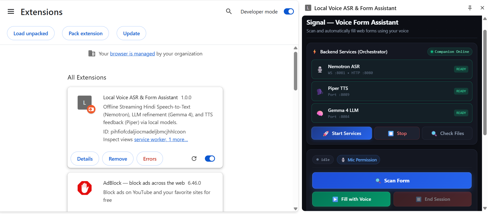
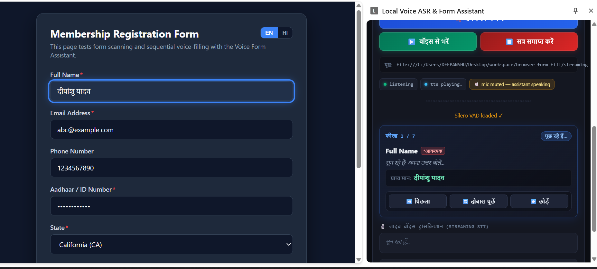

# 🎙️ Local Voice ASR & Form Assistant — Chrome Extension Manual

An offline, privacy-first Chrome Extension (Manifest V3) that provides real-time streaming Hindi Speech-to-Text (ASR), large language model (LLM) intent classification and correction, and high-quality Text-to-Speech (TTS) voice responses—all powered by local models running natively on Windows CPU.

---

## 🎥 Video Demonstration

### 📺 Part 1: End-to-End Walkthrough & Live Session

[](https://youtu.be/W0ftU5tn1mg "Click to Watch Part 1 Demo on YouTube")

> 🔗 **Watch Video on YouTube**: [https://youtu.be/W0ftU5tn1mg](https://youtu.be/W0ftU5tn1mg)

---

## 📸 Visual Tour & Interface Overview

### 1. Extension Loaded & Services Orchestration



When the extension is loaded in Google Chrome, it opens as a persistent **Side Panel** on the right side of the browser:

* **⚡ Companion Status**: Displays `Companion Online` (green indicator) when connected to the local companion daemon at `http://127.0.0.1:8000`.
* **🎙️ Nemotron Streaming ASR Card**: Monitors the streaming Speech-to-Text engine (`WS :8082/v1/realtime` & `HTTP :8080`). Displays `READY` when listening.
* **🗣️ Piper TTS Card**: Monitors the offline Hindi speech synthesis engine (`Port :8089`). Displays `READY` when available.
* **🧠 Gemma 4 LLM Card**: Monitors the local `llama-server` running Gemma 4 E2B (`Port :8084`). Displays `READY` when loaded.
* **Service Actions**:
  * **🚀 स्टार्ट सर्विसेज (Start Services)**: 1-click startup that checks local models and spawns all 3 background AI processes.
  * **⏹️ स्टॉप (Stop)**: Gracefully terminates the 3 AI server processes.
  * **🔍 चेक फाइल्स (Check Files)**: Verifies presence and integrity of models and binaries without re-downloading.

---

### 2. Live Voice Session & Interactive Dialogue



Once services are active, the voice session is ready to begin:

* **Session Toggle**: Press **सत्र समाप्त करें / सेशन शुरू करें** (or press <kbd>Space</kbd>) to start or stop microphone capture.
* **🎙️ माइक अनुमति (Mic Permission)**: Direct link to quickly approve microphone access in a dedicated tab.
* **Real-time Signal Strip (RMS VU Meter)**: Visualizes incoming audio levels in real time and highlights speech vs. silence boundaries detected by **Silero VAD**.
* **लाइव ट्रांसक्रिप्शन (Streaming STT)**: Displays live, low-latency partial and interim Hindi transcripts as you speak.
* **कमांड इतिहास और पुष्टि संवाद (Command History & Verification)**:
  * Records finalized speech utterances with exact timestamps.
  * `✗` indicates raw recognized transcript awaiting user verification.
  * `✓` indicates confirmed and accepted command.
  * `🟡` indicates contextual correction applied by the local LLM.
* **Tuning Parameters (Accordion)**:
  * **Silero Speech Threshold** (Default: `0.50`): Adjusts sensitivity of speech detection.
  * **Silence Before Turn Finalizes** (Default: `320 ms`): Delay before speech is finalized.
  * **Max Utterance Hard Cap** (Default: `3500 ms`): Maximum continuous speaking window.
  * **Pre-roll Padding** (Default: `200 ms`): Audio captured just before speech onset to prevent clipping.
  * **LLM Proxy Server URL**: Endpoint for Gemma 4 intent classification and command rewriting (`http://127.0.0.1:8000/v1/chat/completions`).
  * **Confirmation Debounce**: Window for buffering follow-up replies.

---

## 🏗️ Architecture & Component Flow

```
┌─────────────────────────────────────────────────────────────────┐
│ Google Chrome (Extension Context)                              │
│                                                                 │
│  ┌───────────────────────┐         ┌─────────────────────────┐  │
│  │  sidepanel.html / js  │         │    Silero VAD (ONNX)    │  │
│  │  - User Interface     │────────▶│  - Client-Side Wasm     │  │
│  │  - Audio Capture      │         │  - 16 kHz PCM Gating    │  │
│  └───────────┬───────────┘         └─────────────────────────┘  │
│              │                                                  │
└──────────────┼──────────────────────────────────────────────────┘
               │ (WebSockets & REST)
               ▼
┌─────────────────────────────────────────────────────────────────┐
│ Local Host OS (Windows CPU)                                     │
│                                                                 │
│  ┌───────────────────────────────────────────────────────────┐  │
│  │ Companion Orchestrator & Proxy Server (:8000)             │  │
│  │ - Binary/Model Checker & Downloader                       │  │
│  │ - Process Manager (Spawns & Monitors Background Servers)  │  │
│  │ - TTS & LLM Reverse Proxy (Resolves CORS & Preflights)    │  │
│  └────────────────┬───────────────────┬───────────────────┬──┘  │
│                   │                   │                   │     │
│                   ▼                   ▼                   ▼     │
│          ┌─────────────────┐ ┌─────────────────┐ ┌───────────┐  │
│          │ CrispASR        │ │ CrispASR        │ │ llama.cpp │  │
│          │ Nemotron ASR    │ │ Piper TTS       │ │ Gemma 4   │  │
│          │ :8082 WS / 8080 │ │ :8089 HTTP      │ │ :8084 HTTP│  │
│          └─────────────────┘ └─────────────────┘ └───────────┘  │
└─────────────────────────────────────────────────────────────────┘
```

---

## 📦 Required Models & Binaries

The system verifies existing files in `Desktop\workspace\browser-form-fill\` and skips downloading if they already exist:

| Component | Target Location | Description |
| :--- | :--- | :--- |
| **CrispASR Engine** | `bin\crispasr.exe` | Multi-backend ASR & TTS server |
| **llama-server Engine** | `bin\llama-server.exe` | llama.cpp server with CPU AVX2 acceleration |
| **Nemotron ASR Model** | `models\nemotron-3.5-asr-streaming-0.6b-q4_k.gguf` | 0.6B streaming Speech-to-Text model |
| **Piper TTS Model** | `models\hi_IN-rohan-medium.gguf` | Hindi voice synthesis model |
| **Gemma 4 LLM** | `models\gemma-4-E2B-it-UD-Q4_K_XL.gguf` | 2.6B parameter command correction model |
| **Silero VAD** | `extension\silero_vad.onnx` | Bundled WebAssembly Voice Activity Detector |

---

## 🚀 Step-by-Step Installation & Setup

### Step 1: Start the Companion Orchestrator
Open a command prompt terminal and run:
```cmd
cd Desktop\workspace\browser-form-fill\streaming_demos\companion
start_companion.bat
```
*(Or run `node server.js`)*. The companion starts listening at `http://127.0.0.1:8000/`.

---

### Step 2: Load the Extension in Google Chrome
1. Open Google Chrome and navigate to:
   ```
   chrome://extensions
   ```
2. Enable **Developer mode** via the toggle switch in the top-right corner.
3. Click the **Load unpacked** button in the top-left corner.
4. Browse and select the extension folder:
   ```
   Desktop\workspace\browser-form-fill\streaming_demos\extension
   ```
5. **Local Voice ASR & Form Assistant** will now appear in your active extensions list.

---

### Step 3: Grant Microphone Permission (One-Time Setup)
Because Chrome Side Panels do not have a URL bar to display permission bubbles:
1. Open the Side Panel by clicking the extension icon in Chrome's toolbar.
2. Click **`🎙️ माइक अनुमति`** (or click **सेशन शुरू करें**).
3. A permission tab will automatically open asking:
   > *"Local Voice ASR & Form Assistant wants to: Use your microphone"* &rarr; Click **Allow**.
4. The tab displays `✅ अनुमति मिल गई!` and closes itself. Microphone permission is now permanently granted to the extension origin!

---

### Step 4: Boot AI Services & Begin Voice Session
1. In the Side Panel, click **🚀 स्टार्ट सर्विसेज**.
2. The companion will boot the 3 local AI processes. Within a few seconds, all three indicators turn green (**READY**).
3. The session button unlocks as **`सेशन शुरू करें`**.
4. Click **सेशन शुरू करें** (or press <kbd>Space</kbd>).
5. The assistant greets you:
   > *"नमस्ते, कृपया अपना कमांड बोलें।"*
6. Speak your Hindi command into the microphone.
7. The assistant transcribes in real time and asks:
   > *"क्या आपका मतलब यह था: [आपका कमांड]? हाँ बोलें, या बताएं कि क्या सुधारना है।"*
8. Reply **"हाँ / जी / ठीक है"** to confirm, or state your correction to have Gemma 4 rewrite the text!

---

## 🛠️ Developer & Troubleshooting Guide

### Where to View Extension Logs

Chrome separates extension logs into two separate DevTools consoles:

#### 1. Side Panel Console (VAD, WebSockets, Audio, UI)
* **How to open**: Right-click anywhere inside the Side Panel and select **Inspect**.
* **What you see**: Audio frame RMS values, Silero VAD state transitions, incoming WebSocket JSON packets from Nemotron, and TTS audio playback events.

#### 2. Background Service Worker Console
* **How to open**: Go to `chrome://extensions`, find the extension card, and click the blue link: **`service worker`**.
* **What you see**: Side panel registration, extension installation events, and lifecycle handlers.

#### 3. Companion Server Console
* **How to open**: Look at the terminal window running `node server.js`.
* **What you see**: Process spawn logs, stdout/stderr streams from `crispasr.exe` and `llama-server.exe`, and HTTP reverse proxy requests.

---

## 📄 License

This extension and documentation are distributed under the [MIT License](../LICENSE.txt).
